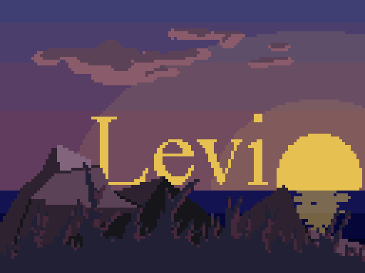

 
  

<h1 align="center">About me</h1>
<i>To love another person is to see the face of God. — Victor Hugo</i>

<h2 align="center">Why "the worst"?</h2>

  Don't get me wrong, I am not a pessimist.
  This username is a "me" thing. Seeing myself as "the worst" should always motivate me to be better.
  I am currently a teenage student, so it means I don't have many projects yet, even though here you may find some repositories with some silly things. These are basically my first projects ever.

<h1>Contact</h1>
<h2>✉️ E-mail:</h2> <i>levisls.inbox@gmail.com</i>
<h2>👾 Discord:</h2> <i>levi_the_worst</i>

<h1>Languages</h1>
  

    
  

